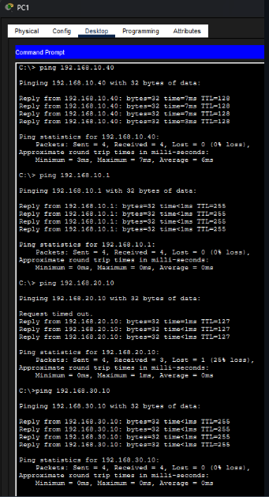

# Standard IP Routing Infrastructure 🌐

## 📌 Overview
This project establishes a fundamental Star Topology network, focusing on the essential principles of **IP Routing** and **Gateway Configuration**. By connecting multiple end-devices through a switch to a central router, the lab demonstrates how traffic is directed from a local area network (LAN) to its default exit point.

> **Status:** Completed & Verified ✅

## 📐 Network Topology
The design follows a hierarchical star model for clear traffic management:
- **Central Router:** Functions as the Default Gateway.
- **Access Switch:** Provides physical layer connectivity for the workstations.
- **End Devices:** 3 PCs configured with distinct static IP addresses within the same subnet.

## 🛠️ Technical Specifications
- **Hardware:** Cisco Router (ISR), Cisco Catalyst Switch.
- **Protocols:** IP (IPv4), ICMP (Ping).
- **Configuration Type:** Static Addressing.

## ⚙️ Configuration Workflow

### 1. Interface Setup
The Router interface connected to the switch was activated and assigned the first usable IP of the subnet, acting as the **Default Gateway** for all hosts.

### 2. Host Configuration
Each PC was manually configured with:
- **IP Address:** Unique identifier within the subnet.
- **Subnet Mask:** Defining the network boundaries.
- **Default Gateway:** Pointing to the Router's interface IP.

## 🧪 Connectivity Results
The implementation was verified using the **Ping (ICMP)** command to ensure stable communication between all nodes and the gateway.

| From | To | Result |
| :--- | :--- | :--- |
| PC-0 | Router (Gateway) | Success (0% loss) |
| PC-0 | PC-2 | Success (0% loss) |

---
**Developed by:** Eduardo Almeida  
*Building solid foundations in Network Engineering.*
